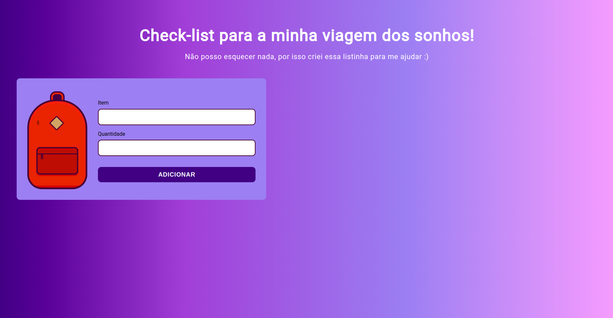
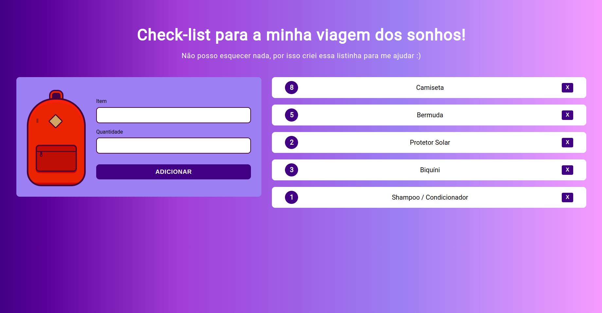

<h1 align="center"> Check-list de viagem utilizando JavaScript </h1>

Projeto disponibilizado no curso da Alura - Armazenando dados no navegador, onde foi possível desenvolver um check-list de itens para serem levados em uma viagem, como também suas quantidades, também é possível além remover os itens desejados, atualizar a quantidade de itens já cadastrados!. Dentre os muitos aprendizados tirados deste curso, o principal consistiu em registrar/remover dados no localStorage do navegador. 

 

  
  

 

# 🚀 Tecnologias

Esse projeto foi desenvolvido com as seguintes tecnologias:

- HTML e CSS
- JavaScript e DOM

 
---

Feito com ♥ by Karine Brandelli
